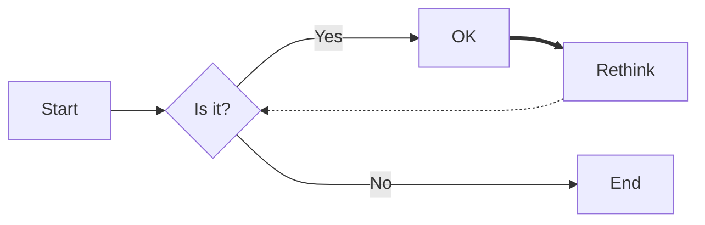
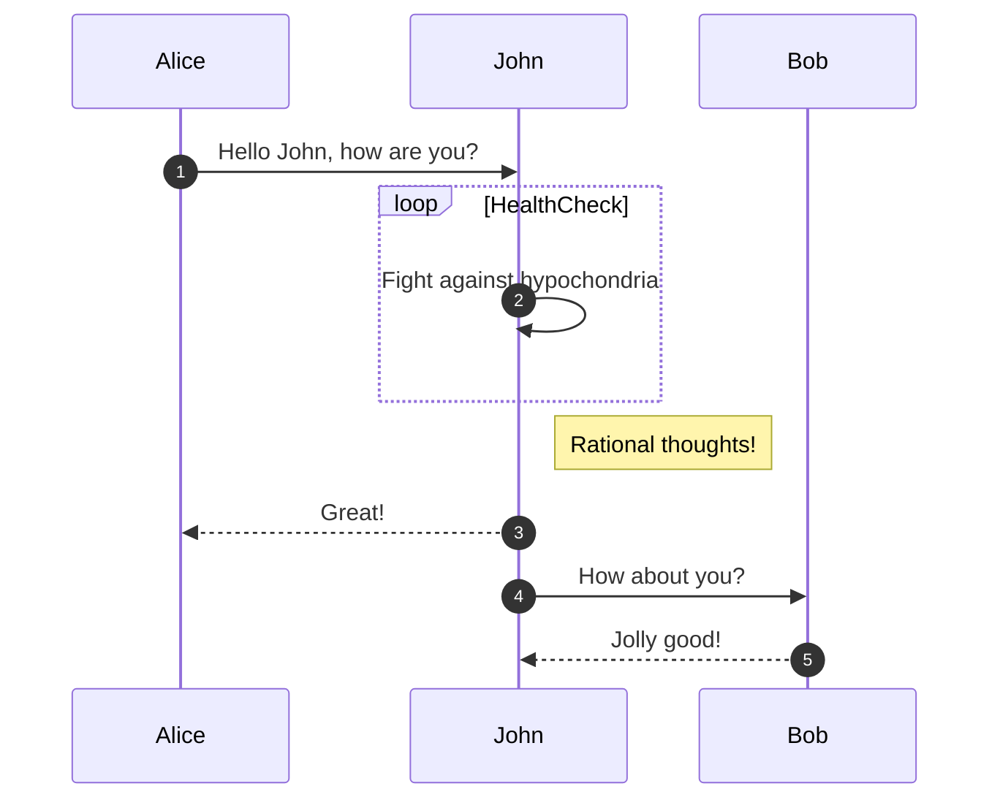
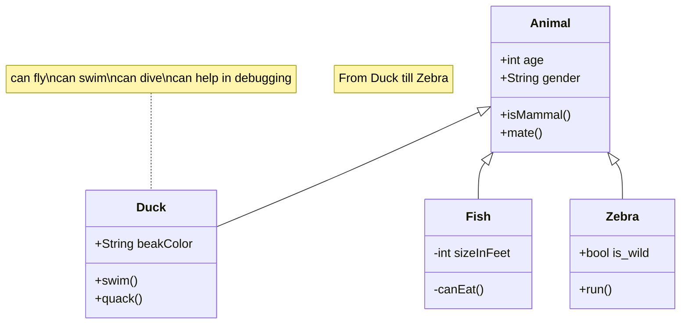
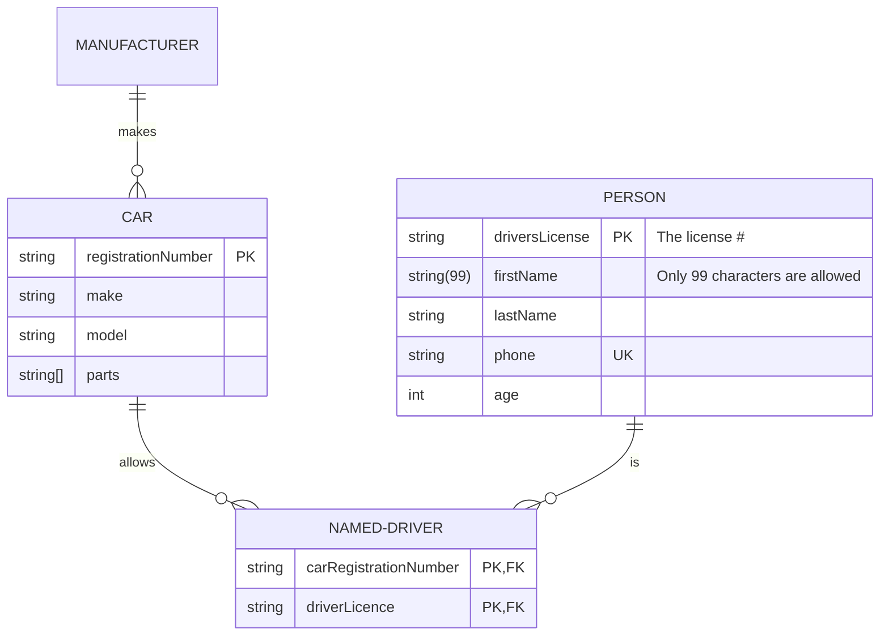
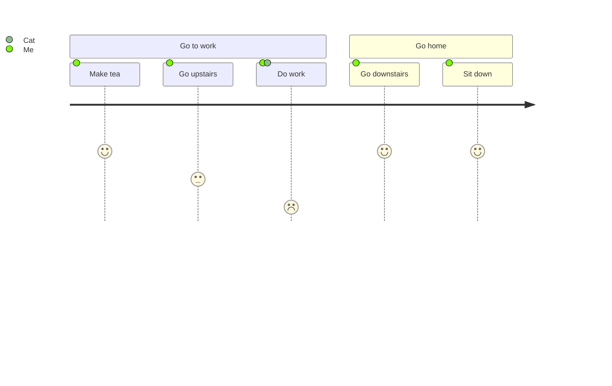
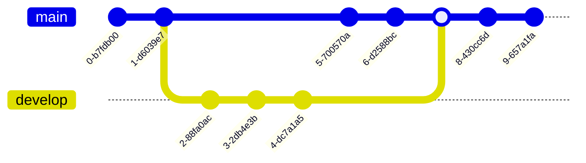
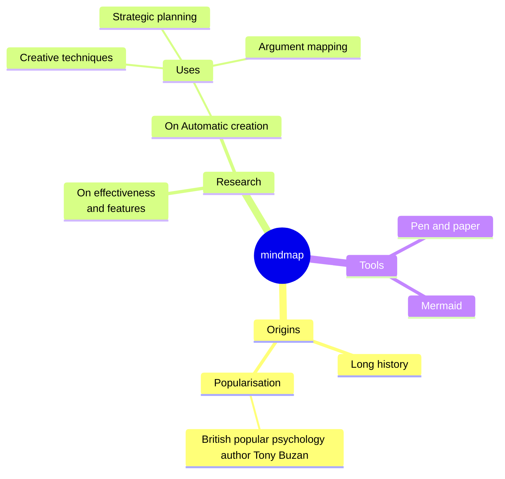
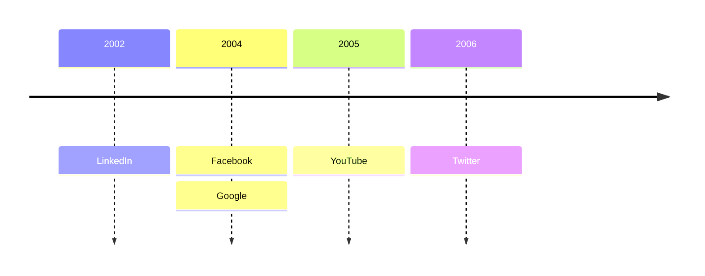
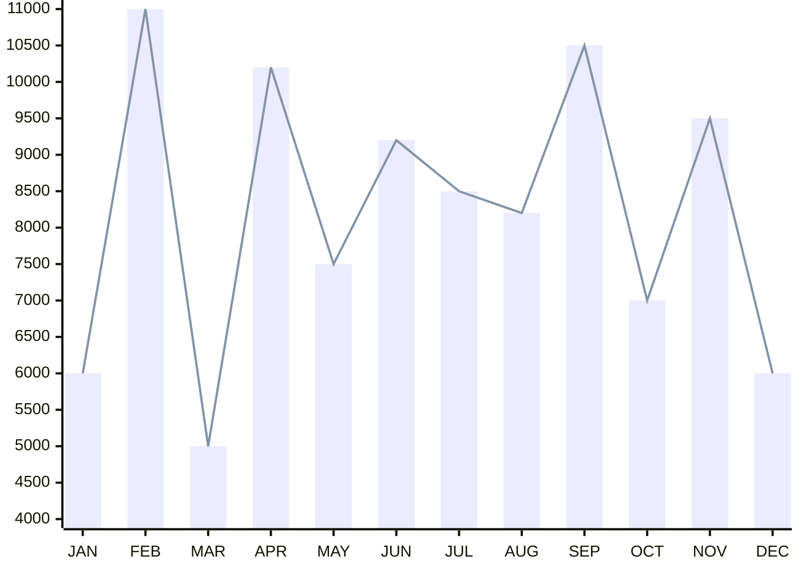
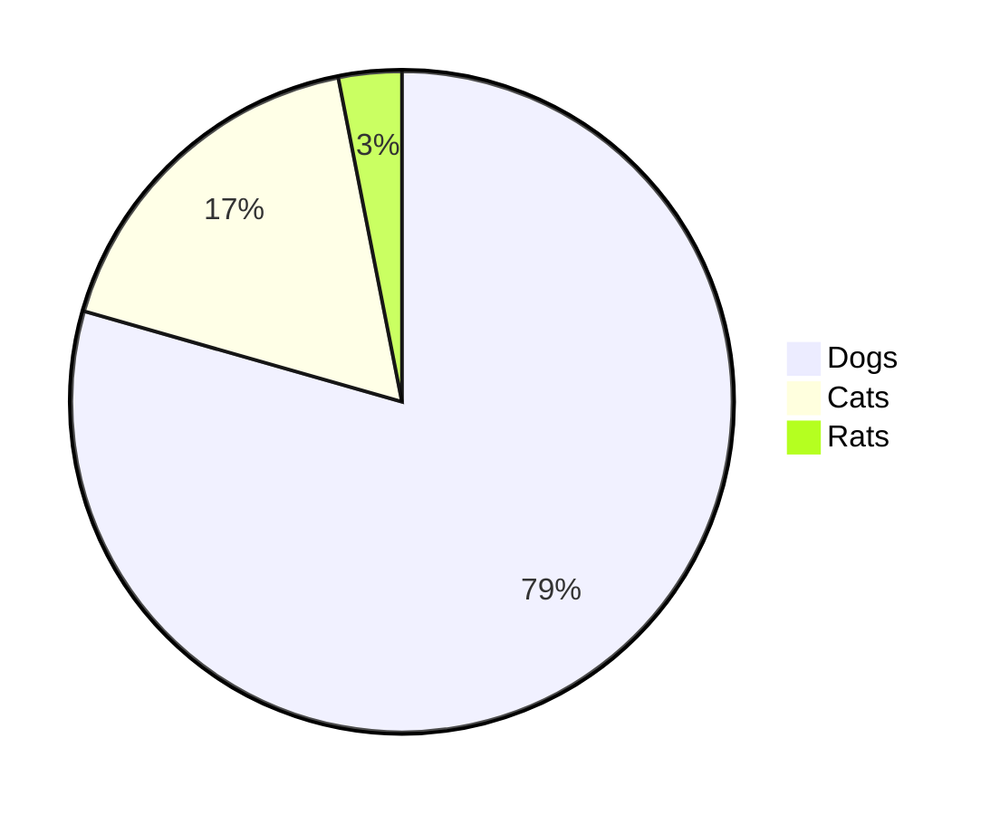

```mermaid
flowchart LR
    A[Start] --> B{Is it?}
    B -->|Yes| C[OK]
    C ==> D[Rethink]
    D -...-> B
    B ---->|No| E[End]
```

```mermaid
sequenceDiagram
    autonumber
    Alice ->> John: Hello John, how are you?
    loop HealthCheck
        John ->> John: Fight against hypochondria
    end
    Note right of John: Rational thoughts!
    John -->> Alice: Great!
    John ->> Bob: How about you?
    Bob -->> John: Jolly good!
```

```mermaid
classDiagram
    note "From Duck till Zebra"
    Animal <|-- Duck
    note for Duck "can fly\ncan swim\ncan dive\ncan help in debugging"
    Animal <|-- Fish
    Animal <|-- Zebra
    Animal: +int age
    Animal: +String gender
    Animal: +isMammal()
    Animal: +mate()
    class Duck {
        +String beakColor
        +swim()
        +quack()
    }
    class Fish {
        -int sizeInFeet
        -canEat()
    }
    class Zebra {
        +bool is_wild
        +run()
    }
```

```mermaid
erDiagram
    CAR ||--o{ NAMED-DRIVER: allows
    CAR {
        string registrationNumber PK
        string make
        string model
        string[] parts
    }
    PERSON ||--o{ NAMED-DRIVER: is
    PERSON {
        string driversLicense PK "The license #"
        string(99) firstName "Only 99 characters are allowed"
        string lastName
        string phone UK
        int age
    }
    NAMED-DRIVER {
        string carRegistrationNumber PK, FK
        string driverLicence PK, FK
    }
    MANUFACTURER only one to zero or more CAR: makes
```

```mermaid
journey
    section Go to work
        Make tea: 5: Me
        Go upstairs: 3: Me
        Do work: 1: Me, Cat
    section Go home
        Go downstairs: 5: Me
        Sit down: 5: Me
```

```mermaid
gitGraph
    commit
    commit
    branch develop
    commit
    commit
    commit
    checkout main
    commit
    commit
    merge develop
    commit
    commit
```

```mermaid
mindmap
  root((mindmap))
    Origins
      Long history
      ::icon(fa fa-book)
      Popularisation
        British popular psychology author Tony Buzan
    Research
      On effectiveness<br/>and features
      On Automatic creation
        Uses
            Creative techniques
            Strategic planning
            Argument mapping
    Tools
      Pen and paper
      Mermaid
```

```mermaid
timeline
    2002: LinkedIn
    2004: Facebook
            : Google
    2005: YouTube
    2006: Twitter
```

```mermaid
xychart-beta
    x-axis [JAN, FEB, MAR, APR, MAY, JUN, JUL, AUG, SEP, OCT, NOV, DEC]
    y-axis 4000 --> 11000
    bar [6000, 11000, 5000, 10200, 7500, 9200, 8500, 8200, 10500, 7000, 9500, 6000]
    line [6000, 11000, 5000, 10200, 7500, 9200, 8500, 8200, 10500, 7000, 9500, 6000]
```

```mermaid
pie
    "Dogs": 386
    "Cats": 85
    "Rats": 15
```
